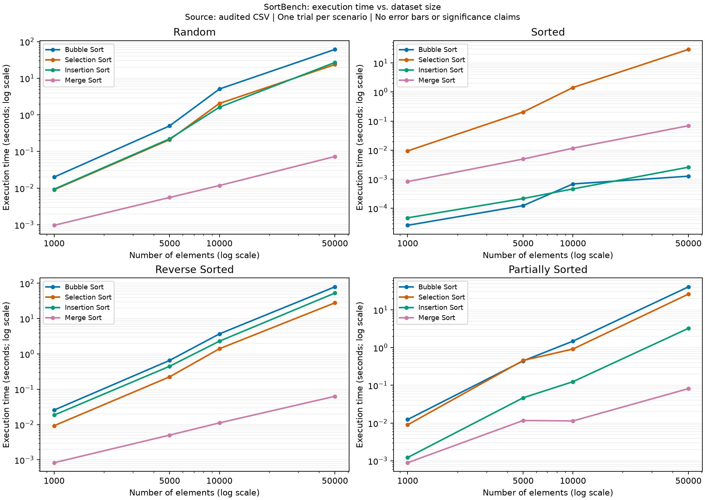

# SortBench

A Python assignment comparing Bubble, Selection, Insertion, and Merge Sort
across four dataset orderings and four sizes. The question is: **how do sorting
performance and scalability change with input size and ordering?**

**Version:** v1.0.0. Implementation and Day 7 quality assurance are complete:
**363 tests pass**, all **64 benchmark scenarios** are recorded, and the final
charts, recommendations, [three-page report](docs/PERFORMANCE_ANALYSIS.pdf),
and retrospective are included. All project work is pushed to GitHub. Creating
a GitHub Release page is deferred by user request; see the
[release checklist](docs/RELEASE_CHECKLIST.md).

## Setup and run

From this repository directory in Windows PowerShell:

```powershell
python -m venv .venv
.\.venv\Scripts\python.exe -m pip install -r requirements-lock.txt
.\.venv\Scripts\python.exe main.py
```

Calling the virtual environment's interpreter directly avoids requiring a
PowerShell activation script. On macOS/Linux use `.venv/bin/python` instead.
The lock file captures the verified Windows/Python 3.14.4 environment;
`requirements.txt` lists direct dependencies for a flexible installation. Other
Python versions and platforms have not been verified.
The sorting demonstration and Day 1 runtime spike use only the standard library and can
also be run directly with `python main.py` and `python scripts/runtime_spike.py`.

Run the complete correctness test suite:

```powershell
.\.venv\Scripts\python.exe -m pytest
```

`main.py` runs each algorithm on `[8, 3, 1, 6, 4]` and displays
`[1, 3, 4, 6, 8]`, followed by examples of all four dataset types using 20
elements and seed 0. This demonstration does not time sorts or generate
benchmark results.

Use an algorithm directly:

```python
from algorithms import merge_sort

values = [8, 3, 1, 6, 4]
result = merge_sort(values)
assert result is values
assert values == [1, 3, 4, 6, 8]
```

Every algorithm modifies and returns the supplied list. See the
[algorithm guide](docs/ALGORITHMS.md) for behavior and complexity.

Generate reproducible datasets:

```python
from data import SIZES, generate_random, generate_partially_sorted

assert SIZES == [1000, 5000, 10000, 50000]
random_values = generate_random(1000)  # Default seed: 506 + 1000
partial_values = generate_partially_sorted(1000)
assert sorted(random_values) == sorted(partial_values)
```

All generators accept a keyword `seed` override and return fresh lists. See the
[dataset guide](docs/DATA_GENERATION.md) for ordering, seed, and validation rules.

Run a small benchmark from the repository root:

```powershell
.\.venv\Scripts\python.exe -c "from benchmark import run_benchmarks; run_benchmarks('results/my_smoke.csv', sizes=[10, 100])"
```

This writes 32 validated rows and `results/my_smoke.metadata.json`. Each run
requires a new output filename. Existing results are never overwritten.
See [the runner guide](docs/BENCHMARK_RUNNER.md) for the full Day 5 command,
output fields, and handling incomplete runs. The committed
[Day 4 smoke results](results/day4_smoke.csv) verify the pipeline and are not
the final experiment dataset.

The full [benchmark CSV](results/benchmark_results.csv),
[metadata](results/benchmark_results.metadata.json), and
[audit report](results/validation_report.json) are available. Read the
[Day 5 observations](docs/DAY5_OBSERVATIONS.md) for timings, observed winners,
and limitations. The primary dataset uses one trial per scenario; no averages
across attempts or selectively chosen fastest measurements are reported.

## Analysis and charts

Regenerate the derived outputs from the audited primary CSV:

```powershell
.\.venv\Scripts\python.exe -m analysis.performance_analyzer
```

See the [analysis workflow](docs/ANALYSIS_WORKFLOW.md) for the API, artifacts,
and provenance. This command does not rerun benchmarks or change measurements.



Merge Sort had the lowest recorded time in all 12 random, reverse-sorted,
and partially sorted groups. Bubble won three sorted groups and Insertion
one; the separate diagnostic changed their ranking at 10,000 elements.
These are single-trial observations, not statistically established advantages.
See the [performance analysis](docs/PERFORMANCE_ANALYSIS.md),
[recommendation guide](docs/RECOMMENDATION_GUIDE.md), and
[ordering comparison chart](results/analysis/charts/dataset_comparison.png).

## Required experiment

| Dimension | Values |
|---|---|
| Algorithms | Bubble, Selection, Insertion, Merge |
| Dataset types | Random, sorted, reverse-sorted, partially sorted |
| Sizes | 1,000; 5,000; 10,000; 50,000 |
| Total | 64 scenarios |

Timing uses `time.perf_counter()`. Each algorithm receives an independent copy
of equivalent data, and every result is checked against `sorted(original)`.
Generation, copying, validation, and CSV writing are outside the timed interval.

## Repository layout

```text
main.py                 Sorting and dataset-generation demonstration
requirements.txt        pytest, pandas, matplotlib
algorithms/             Four sorting algorithms (Day 2)
data/                   Dataset generation (Day 3)
benchmark/              Timer and runner (Day 4)
analysis/               Summaries and recommendations (Day 6)
visualization/          Charts (Day 6)
results/                Actual measured data and generated charts
tests/                  Correctness and integration tests (Days 2 onward)
scripts/runtime_spike.py Bounded Day 1 feasibility experiment
docs/                   Requirements, plans, methodology, and reports
```

## Project documents

- [Original assignment plan](docs/ASSIGNMENT_PLAN.md)
- [Implementation checklist](docs/PROJECT_PLAN.md)
- [Release checklist and verification](docs/RELEASE_CHECKLIST.md)
- [Release notes](docs/RELEASE_NOTES.md)
- [Final three-page PDF](docs/PERFORMANCE_ANALYSIS.pdf)
- [APA-style project report](docs/APA_PROJECT_REPORT.pdf)
- [Requirements](docs/REQUIREMENTS.md)
- [Architecture and benchmark workflow](docs/ARCHITECTURE.md)
- [Benchmark methodology](docs/BENCHMARK_METHODOLOGY.md)
- [Running benchmarks and interpreting metadata](docs/BENCHMARK_RUNNER.md)
- [Result validation](docs/RESULT_VALIDATION.md)
- [Day 5 measured observations](docs/DAY5_OBSERVATIONS.md)
- [Test plan](docs/TEST_PLAN.md)
- [Algorithm implementations and complexity](docs/ALGORITHMS.md)
- [Dataset generation and reproducibility](docs/DATA_GENERATION.md)
- [Day 1 runtime spike](docs/RUNTIME_SPIKE.md)
- [Performance analysis](docs/PERFORMANCE_ANALYSIS.md)
- [Measured recommendation guide](docs/RECOMMENDATION_GUIDE.md)
- [Retrospective](docs/RETROSPECTIVE.md)

Version `v1.0.0` contains the seven-day implementation. The original assignment
is preserved unchanged; actual completion evidence is in the release checklist.
Dashboards, additional algorithms, CI, and repeated-trial statistics remain
future portfolio enhancements.
