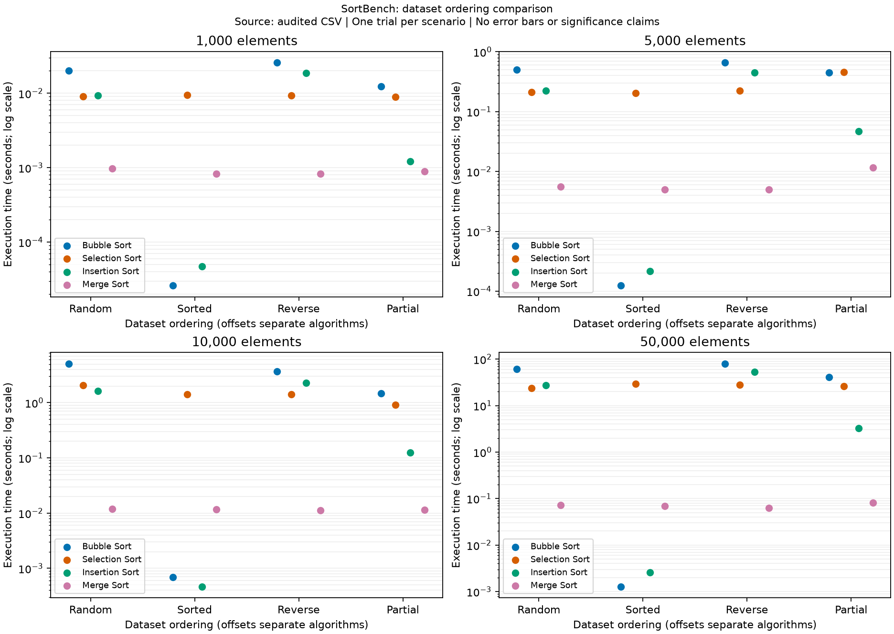
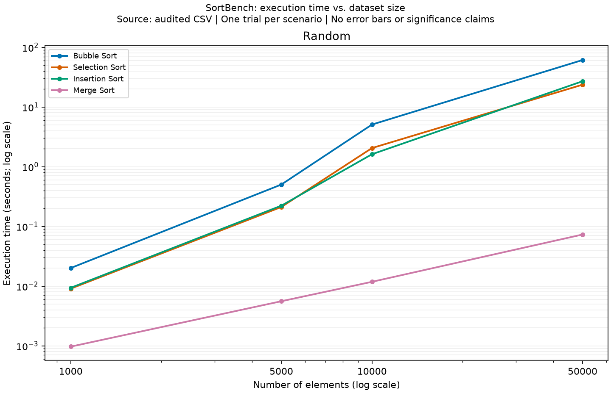
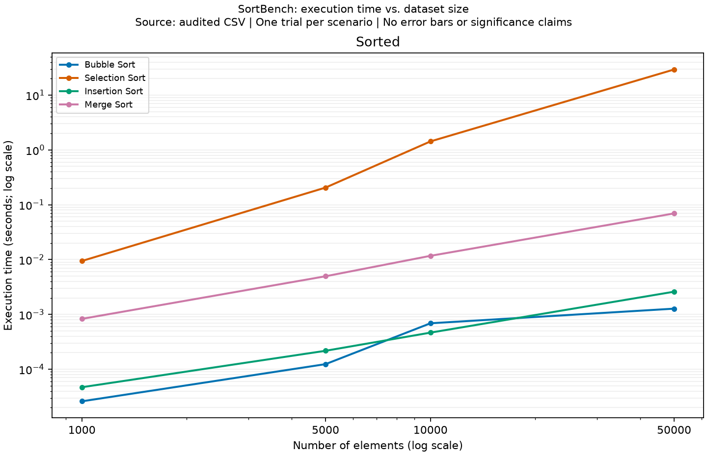
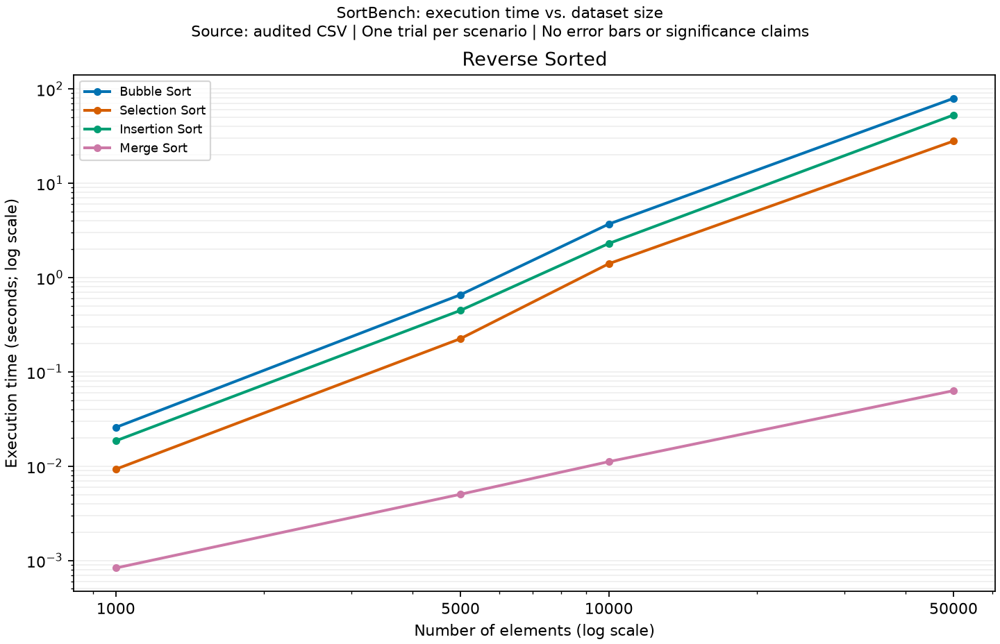
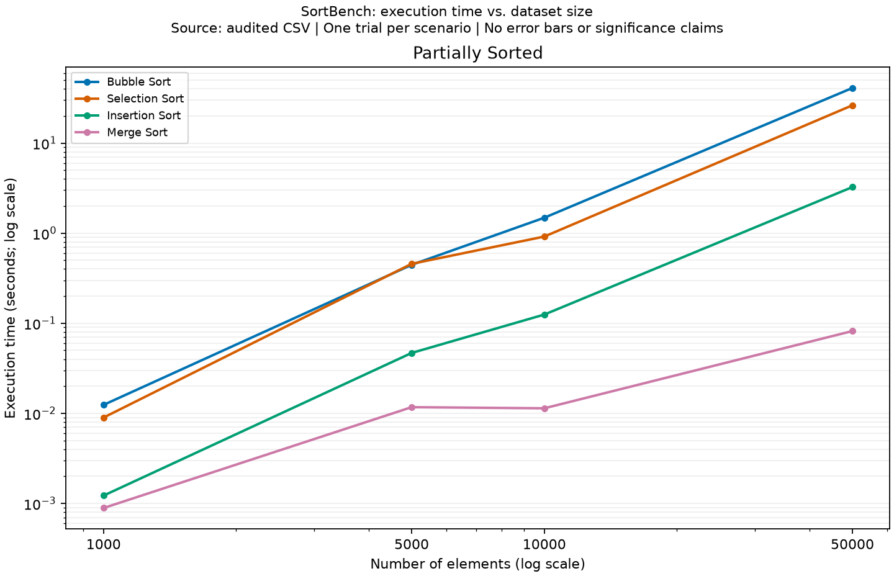

# Sorting Algorithm Benchmarking in Python: Effects of Input Size and Ordering

Shreyash  
CSC506: Design and Analysis of Algorithms  
Colorado State University Global  
October 2026

## Abstract

This project evaluated four comparison-based sorting algorithms--Bubble Sort, Selection Sort, Insertion Sort, and Merge Sort--across four input orderings and four input sizes. The study used 64 benchmark scenarios: random, sorted, reverse-sorted, and partially sorted integer lists with 1,000, 5,000, 10,000, and 50,000 elements. Each scenario was measured once in Python 3.14.4 on Windows 11 using `time.perf_counter()`, and every result was validated against Python's independently computed `sorted(original)` output. The results supported the expected algorithmic patterns described by standard algorithm analysis: Merge Sort scaled best on random, reverse-sorted, and partially sorted inputs, while adaptive quadratic algorithms were strongest on already sorted inputs. Because the benchmark used one recorded trial per scenario, the findings should be treated as transparent project evidence rather than statistically generalizable performance claims. The final recommendation is to use Merge Sort for disordered inputs when extra memory is acceptable, and to consider Bubble Sort or Insertion Sort for inputs known to be already sorted.

## Introduction

Sorting algorithms provide a useful way to connect theoretical complexity with observed runtime behavior. Asymptotic analysis explains how algorithms grow as input size increases, but measured performance also depends on implementation choices, input order, timer behavior, and the execution environment. Cormen et al. (2022) present sorting as a core topic in algorithm design and analysis because it shows how different strategies can solve the same problem with very different time and space costs.

The purpose of SortBench was to compare four manually implemented sorting algorithms under controlled project conditions. The algorithms were selected because they represent different design trade-offs. Bubble Sort and Insertion Sort can finish quickly when the input is already ordered. Selection Sort performs a predictable quadratic scan pattern with limited swaps. Merge Sort uses divide and conquer to provide `O(n log n)` behavior across orderings, but it requires auxiliary storage. The project asked how performance changes when both input size and input ordering change.

Python's built-in sorting behavior was not the target of the benchmark. It was used only as a correctness oracle. The Python Sorting HOWTO explains that Python's sorting operations are stable and that Timsort can exploit ordering already present in data (Python Software Foundation, 2026b). SortBench instead focuses on the four course algorithms so their behavior can be examined directly.

## Method

The benchmark used four dataset types: random, sorted, reverse-sorted, and partially sorted. The four input sizes were 1,000, 5,000, 10,000, and 50,000 integers. Each size used a deterministic seed, and all orderings for that size shared the same multiset of values. That design made the orderings comparable without changing the underlying values. The partially sorted dataset began sorted and then applied `size // 20` random swaps, so it represented a controlled disturbance of an ordered list rather than a precise claim that five percent of values were misplaced.

The timer measured only the sorting call. Dataset generation, list copying, result validation, and CSV output were excluded from the measured interval. Python's `time.perf_counter()` was selected because the official Python documentation describes it as a high-resolution performance counter suitable for measuring short durations (Python Software Foundation, 2026a). The benchmark metadata recorded Python 3.14.4, Windows 11, one trial per scenario, and 64 completed rows.

Each algorithm received an independent list copy and was required to sort the list in place while also returning the same list object. Correctness validation compared every result with `sorted(original)`. The final analysis used the repeated full benchmark run, not the archived initial run that contained a large wall-time anomaly in one long Bubble Sort case. The analysis therefore reports one complete and audited primary dataset.

## Results

The benchmark results showed two clear patterns. First, Merge Sort dominated the disordered scenarios. It was the fastest recorded algorithm in all random, reverse-sorted, and partially sorted groups. At 50,000 elements, Merge Sort completed random input in 0.0731 seconds, reverse-sorted input in 0.0631 seconds, and partially sorted input in 0.0819 seconds. The closest quadratic competitors for those same scenarios took seconds rather than fractions of a second.

Second, already sorted input changed the ranking. Bubble Sort won at 1,000, 5,000, and 50,000 sorted elements, while Insertion Sort won at 10,000 sorted elements. Those outcomes match the adaptive behavior of the implementations: Bubble Sort can stop after a pass with no swaps, and Insertion Sort performs very little shifting when the prefix is already ordered. Selection Sort did not benefit in the same way because it still searched each unsorted suffix for a minimum.

Table 1 summarizes the 50,000-element observations, where the performance spread is easiest to see.

**Table 1**  
*Execution Time for 50,000 Elements, in Seconds*

| Ordering | Bubble Sort | Selection Sort | Insertion Sort | Merge Sort |
|---|---:|---:|---:|---:|
| Random | 61.1792 | 23.6449 | 27.0069 | 0.0731 |
| Sorted | 0.0013 | 29.2821 | 0.0026 | 0.0695 |
| Reverse-sorted | 79.5163 | 28.0274 | 52.9517 | 0.0631 |
| Partially sorted | 40.8929 | 26.2688 | 3.2475 | 0.0819 |

**Figure 1**  
*Execution time by dataset size.* The logarithmic time scale makes the gap between Merge Sort and the quadratic algorithms visible across all tested sizes.

**Figure 2**  
*Algorithm comparison by dataset ordering.* Ordering strongly affected the adaptive algorithms, especially on sorted input.

**Figure 3**  
*Random dataset performance.* Merge Sort scaled far better than the quadratic algorithms as random input size increased.

**Figure 4**  
*Sorted dataset performance.* Bubble Sort and Insertion Sort benefited from already ordered data, while Selection Sort still performed quadratic scans.

**Figure 5**  
*Reverse-sorted dataset performance.* Reverse order exposed the expensive worst-case behavior of Bubble Sort and Insertion Sort.

**Figure 6**  
*Partially sorted dataset performance.* Insertion Sort improved compared with random and reverse-sorted input, but Merge Sort remained fastest in the tested cases.

## Analysis

The measured growth rates were consistent with the theoretical distinction between `O(n log n)` and `O(n^2)` algorithms. On random input, increasing the size from 1,000 to 50,000 elements increased Merge Sort runtime by about 75.5 times. The quadratic algorithms increased by roughly 2,606 to 3,047 times over the same size range. The theoretical `n log n` growth factor from 1,000 to 50,000 is about 78.3, while the quadratic growth factor is 2,500. The exact measurements should not be treated as a proof of asymptotic behavior, but they align with the expected shape.

Input ordering mattered most for Bubble Sort and Insertion Sort. On sorted input, Bubble Sort grew from 0.000026 seconds at 1,000 elements to 0.001273 seconds at 50,000 elements. Insertion Sort grew from 0.000047 seconds to 0.002595 seconds. Those results are consistent with best-case linear behavior. The sorted case also shows why a single universal recommendation would be misleading: Merge Sort was the strongest general-purpose performer, but it did unnecessary work when the input was already sorted.

Selection Sort was consistent but rarely competitive. Its runtime stayed high even for sorted input because the implementation still scanned the remaining suffix on every pass. Its limited number of swaps may be useful in a different workload where swaps are much more expensive than comparisons, but this project measured integer sorting time rather than costly movement, disk writes, or memory wear.

## Recommendations

The evidence supports three practical recommendations. For random, reverse-sorted, or partially sorted integer lists in the tested size range, Merge Sort is the best time-based choice when `O(n)` extra memory is acceptable. For already sorted data, Bubble Sort or Insertion Sort is more appropriate because the implementations can take advantage of the existing order. For memory-constrained situations, Bubble Sort, Selection Sort, and Insertion Sort use constant auxiliary space, but their time costs become large on disordered inputs.

The project also supports a broader design lesson. Algorithm selection should be based on input characteristics, stability needs, space constraints, and measured evidence. Cormen et al. (2022) emphasize that algorithm analysis provides a way to compare approaches abstractly; SortBench adds concrete project evidence showing how those differences appear in a real implementation.

## Limitations

The main limitation is that each scenario has one recorded trial. That makes the analysis reproducible and transparent, but it does not provide confidence intervals, averages, or error bars. Very short timings, such as sorted 1,000-element cases, are especially sensitive to timer resolution and machine activity. A separate diagnostic run showed that the sorted 10,000-element ranking between Bubble Sort and Insertion Sort could flip by a very small margin, which reinforces the need for repeated trials before making fine-grained claims.

The benchmark also used one Python implementation of each algorithm, one machine, one operating system, one Python version, and one seed per size. Future work should include repeated trials, randomized execution order, multiple seeds, and memory profiling. These additions would make the results stronger and would support more precise claims about variability and crossover points.

## Conclusion

SortBench shows that Merge Sort is the strongest general recommendation for the tested disordered inputs, while adaptive simple algorithms can outperform it when the input is already sorted. The project connects theoretical complexity with measured data: the `O(n log n)` implementation scaled much better on random and reverse-sorted data, and the adaptive algorithms benefited from favorable input order. The final recommendation is therefore conditional rather than absolute. Merge Sort should be selected for scalable general sorting in this project, while Bubble Sort or Insertion Sort should be considered for known sorted data or teaching demonstrations of adaptivity.

## References

Cormen, T. H., Leiserson, C. E., Rivest, R. L., & Stein, C. (2022). *Introduction to algorithms* (4th ed.). The MIT Press. https://mitpress.mit.edu/9780262046305/introduction-to-algorithms/

Knuth, D. E. (1998). *The art of computer programming: Volume 3: Sorting and searching* (2nd ed.). Addison-Wesley.

Python Software Foundation. (2026a). *time - Time access and conversions*. Python 3.14 documentation. https://docs.python.org/3/library/time.html

Python Software Foundation. (2026b). *Sorting techniques*. Python 3.14 documentation. https://docs.python.org/3/howto/sorting.html

